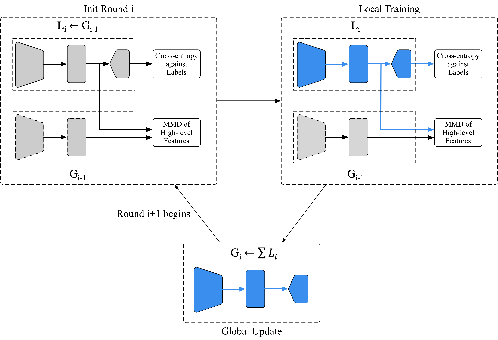

# Two-Stream Federated Learning: Reduce the Communication Costs

The implementation of "Two-Stream Federated Learning: Reduce the Communication Costs" (VCIP 2018). [[PDF]](https://ieeexplore.ieee.org/abstract/document/8698609)

## Introduction

Federated learning algorithm solves the problem of training machine learning models over distributed networks that consist of a massive amount of modern smart devices.
It overcomes the challenge of privacy preservation, unbalanced and Non-IID data distributions, and does its best to reduce the required communication rounds. 
However, communication costs are still the principle constraint compared to other factors, such as computation costs.

In this paper, we adopt a  two-stream model with MMD (Maximum Mean Discrepancy) constraint instead of the single model to be trained on devices in standard federated learning settings. 
Following experiments show that the proposed model outperforms baseline methods, especially in Non-IID data distributions, and achieves a reduction of more than 20\% in required communication rounds.



## Cite

If you find this work useful to you, please cite:

```
@inproceedings{yao2018two,
  title={Two-Stream Federated Learning: Reduce the Communication Costs},
  author={Yao, Xin and Huang, Chaofeng and Sun, Lifeng},
  booktitle={2018 IEEE Visual Communications and Image Processing (VCIP)},
  pages={1--4},
  year={2018},
  organization={IEEE}
}
```
